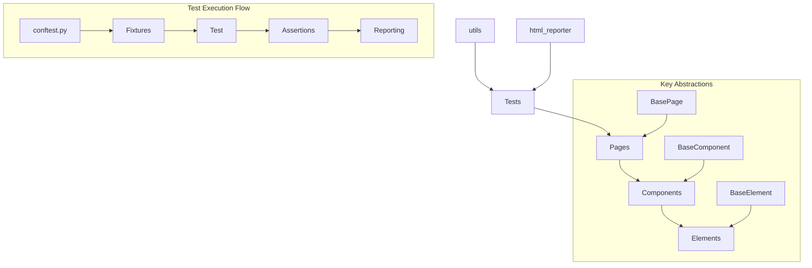

# Test Automation with Playwright Python

This project uses a **[Page Object Model (POM)](https://martinfowler.com/bliki/PageObject.html)** architecture and 
**Object-Oriented Programming (OOP)** approach to automate web interface testing using **[Playwright](https://playwright.dev/python/docs/intro)**.

---

## Installation and Setup

### 1. Minimum Requirements

- **Python**: Version 3.12 or newer.
- **PyCharm**: Recommended for convenient development environment setup.

### 2. Creating a Virtual Environment (venv) in PyCharm

1. **Open your project in PyCharm** or create a new one.
2. Go to menu: **File** → **Settings** (or **Preferences** on Mac).
3. Select: **Project: <your_project>** → **Python Interpreter**.
4. Click on **Add Interpreter** → **Add Local Interpreter**.
5. Choose **Virtual Environment** and ensure the path corresponds to your project folder.
6. In the **Base interpreter** field, select Python 3.12 or a newer version.
7. Click **OK** to create and activate the virtual environment.

### 3. Installing Dependencies

All project dependencies are stored in the **`requirements.txt`** file.

1. Open the terminal in PyCharm or any other terminal.
2. Make sure `uv` is installed (if not, install it):
   ```bash
   curl -LsSf https://astral.sh/uv/install.sh | sh
   ```
3. Create and activate a virtual environment using uv:

**For Windows:**

   ```bash
   uv venv venv
   venv\Scripts\activate
   ```

**For Mac/Linux:**

```bash
uv venv venv
source venv/bin/activate
```

4. Install dependencies from requirements.txt:

```bash
uv pip install -r requirements.txt
```

5. Initialize Playwright to download the necessary browsers:

```bash
playwright install
```

---

## How to Run Tests

### 1. Running Tests in Parallel

**[pytest-xdist](https://pypi.org/project/pytest-xdist/)** is used to run tests in multiple threads, allowing tests to
be executed simultaneously on multiple CPU cores. This significantly reduces test execution time.

- **Run on all available CPU cores**:
  ```bash
  pytest -n auto
  ```
- **Run tests on a specific number of processes**:
  ```bash
  pytest -n 4
  ```

Note: Use the number of processes according to the number of cores in your processor for maximum efficiency.

### 2. Running Tests with a Report and Viewing Results

A custom reporting mechanism is used to generate a detailed and interactive HTML report on test execution. The reporting
implementation is in the `templates/report_handler.py` and `report_template.html` modules.


To run tests with report generation, use the `pytest` command with the `--html-report=reports/test_report.html`
parameter.

```bash
pytest --html-report=reports/test_report.html
```

Additional report options:

- `--report-title="Report Title"` - sets the title for the HTML report
- `--headless=true` - runs tests in headless browser mode

Viewing the report:

- After tests are completed, open the `reports/test_report.html` file in your browser
- The report contains:
    - Overall test execution statistics (passed, failed, skipped, etc.)
    - Interactive filters for analyzing results
    - Timeline of test execution
    - Detailed information about each test, including screenshots and error messages
    - Information about the test environment

The report is automatically generated after all tests are completed and saved at the specified path.

### 3. Running Tests with Retries

**[pytest-rerunfailures](https://pypi.org/project/pytest-rerunfailures/)** is used to automatically rerun unstable
tests. This option allows tests to be repeated in case of temporary errors, reducing the number of false failures (flaky
tests).

```bash
pytest --reruns 2 --reruns-delay 5
```

- `reruns 2`: Retry test execution up to 2 times in case of failure.
- `reruns-delay 5`: 5-second delay between retries.

### Combined Run Example

To run tests in parallel, with HTML reporting and retries:

```bash
pytest -n auto --html-report=reports/test_report.html --reruns 2 --reruns-delay 5
```

This command runs tests in parallel on all available cores, generates an HTML report, and retries unstable tests twice
with a 5-second delay.

---

## Project Architecture Overview

The project architecture is built on the **Page Object Model (POM)** pattern, which separates the logic of pages,
components, and elements of web applications. The main components of this architecture:

- **BasePage**: Base class for all pages, containing common methods for working with web pages (e.g., navigation).
- **BaseComponent**: Base class for components (e.g., header, modal windows) consisting of multiple elements.
- **BaseElement**: Class for working with individual web elements (buttons, input fields, etc.), containing basic
  interaction methods (clicking, entering text, uploading files, etc.).

---

## Project Architecture Diagram



This diagram shows the main components of the architecture and their relationships:

1. **Tests** use **Pages**, which consist of **Components**, which in turn contain **Elements**
2. **BasePage**, **BaseComponent**, and **BaseElement** are abstract classes that define basic functionality for the
   corresponding levels
3. **utils** contain helper functions and tools for all levels of architecture
4. **html_reporter** is responsible for generating reports with test results

## Advantages of Using POM and OOP

1. **Code Readability and Maintenance**: Tests become easier to read as page logic is moved into separate classes.
2. **Code Reuse**: Components and elements can be reused on different pages.
3. **Scalability**: Easy to add new pages and components without changing existing code.
4. **OOP Approach**: Classes encapsulate logic, allowing code to be structured and making it understandable and flexible
   for extension.

---

## `@track_execution_time` Decorator

### Description

The `@track_execution_time` decorator is used to track the execution time of functions and fixtures in tests. It adds
information about method name, execution time, and call order to the pytest HTML report.

### Features

- Automatically adds execution time to the `execution_log` of each test.
- If a function has the name `factory`, the decorator analyzes the call stack and uses a regular expression to get the
  name of the method or function that called `factory`.
- Supports both calls with result assignment (`variable_name = function_name(...)`) and without it (
  `function_name(...)`).

### Usage Example

#### Code with Decorator

```python
import time
import pytest

@track_execution_time
def example_function():
    time.sleep(0.5)
    return "Result"

@pytest.fixture()
def create_owner(page) -> Callable:
    @track_execution_time
    def factory(**kwargs) -> dict:
        time.sleep(0.2)  # Execution simulation
        return {"id": 1, "name": "Owner"}

    return factory

def test_example(create_owner):
    created_info_message = create_owner(name="John Doe")
    delete_info_message(created_info_message["id"])
```

#### HTML Report

When the test is executed, a log with the execution time of methods will appear in the report:

```text
Execution Log
-------------
create_owner: 0.2001 seconds
delete_info_message: 0.0001 seconds
```

---

## Using Soft Assert in Python with pytest_check

### What is Soft Assert?

Soft assert allows you to check multiple conditions in one test without immediately stopping its execution if one of the
checks fails. Unlike regular assert, which stops the test at the first error, soft assert allows the test to continue
running, saving all check results. This is especially useful for tests where you need to check multiple conditions, for
example, the presence of numerous elements on a page.

### What is Soft Assert Used For?

- Checking multiple conditions within one test: if you want to check multiple parts of a response or interface, soft
  assert will allow you to collect all check results before completing the test.
- Increasing report informativeness: you'll get a complete picture of the test, showing all failed checks instead of
  stopping at the first one.
- Convenience for automation: it makes it easy to track and analyze all errors that occur within a single test case.

### How to Use Soft Assert?

The pytest_check library can be used for working with soft assert. Below is an example of using soft assert to check for
the presence of certain text fragments in a PDF document loaded on a page.

```python
# Using soft assert to check multiple conditions without stopping test execution
from pytest_check import check_that


def test_product_details(page):
    # Navigate to product page
    page.goto("https://example.com/products/1")

    # Get product information
    product_name = page.locator(".product-name").text_content()
    product_price = page.locator(".product-price").text_content()
    product_stock = page.locator(".product-stock").text_content()

    # Perform multiple soft assertions
    with soft_assert:
        assert product_name == "Test Product", f"Expected 'Test Product', got '{product_name}'"

    with soft_assert:
        assert "$19.99" in product_price, f"Expected price to contain '$19.99', got '{product_price}'"

    with soft_assert:
        assert "In Stock" in product_stock, f"Expected 'In Stock', got '{product_stock}'"

    with soft_assert:
        assert page.locator(".product-rating").count() > 0, "Product rating element not found"

    # Test continues even if some assertions fail
    page.locator(".add-to-cart").click()
```

### Advantages of Using Soft Assert in Tests

- Efficiency: allows all checks in a test to be performed even when errors occur.
- Detailed reports: the test report shows a complete list of errors, making debugging much easier.
- Reduced fix time: testers can fix multiple errors at once without stopping the test after the first failure.

### When Not to Use Soft Assert

In cases where an error at one stage makes other checks unnecessary or impossible, using soft assert can lead to false
results. In such cases, it's better to use a regular assert, which will immediately stop the test execution.

---

## Code Smells Analyzer for Playwright Tests

This tool is designed for static analysis of UI tests (written using Python, pytest, and Playwright) for common
problems ("code smells") that worsen readability, stability, and maintainability of tests.

### What are Code Smells?

"Code smells" are patterns or signs in code that may indicate deeper problems with architecture, design, or development
practices. They are not direct errors but make understanding and developing code more difficult. Using a tool to detect
them allows quicker identification of problem areas in tests.

### Why These Checks?

The set of identified problems is inspired by the book **xUnit Test Patterns: Refactoring Test Code** (by Gerard
Meszaros). This book describes common anti-patterns and testing practices to avoid, as well as suggesting better ways to
organize and write tests.

This tool checks for the following patterns (code smells):

1. **Assertion Roulette**: Too many checks in one test without clear messages.
2. **Too Many Conditions**: Excessive number of `if` statements that complicate understanding of test logic.
3. **Too Many Loops**: Large number of `for` or `while` loops indicates the need for parameterization or simplification.
4. **Mystery Guest**: Test relies on external files or resources.
5. **Hard-coded Selector**: Direct use of selectors in the test instead of constants or page objects.
6. **Fixed Timeout**: Using `wait_for_timeout` instead of dynamic waits.
7. **Direct Sleep**: Using `time.sleep` instead of Playwright synchronization methods.
8. **Test Too Long**: An excessive number of statements in a test (excluding docstring) indicates an overly complex
   scenario.

### Note on Acceptable Parameter Values

The following default values are used:

- `max_asserts: int = 30`
- `max_conditions: int = 3`
- `max_loops: int = 3`
- `max_test_length: int = 200`

Usually, such high values do not correspond to best practices, as a large number of checks, conditions, or loops in one
test complicates its structure and understandability. However, in our specific project, we are automating tests at a
very late stage of development (at the UAT level), when everything has already been developed and manually tested. Our
goal is to cover long and complex scenarios that are already implemented manually, instead of creating a large number of
short and simple tests. This is due to the high cost of generating data and maintaining a large number of small tests.
Therefore, we deliberately set more liberal thresholds.

### How to Use?

1. Run the command:
   ```bash
   python code_smell_analyzer.py --dir=../tests --max-asserts=30 --max-conditions=3 --max-loops=3 --max-test-length=200
   ```
   Flags:
    - `--dir:` path to the directory with tests (default ../tests).
    - `--max-asserts:` maximum number of checks in one test (default: 30).
    - `--max-conditions:` maximum number of conditions in one test (default: 3).
    - `--max-loops:` maximum number of loops in one test (default: 3).
    - `--max-test-length:` maximum number of statements in a test (excluding docstring), default 200.
2. The result will be output to the console. You will see tests with detected "code smells", as well as statistics (
   number of tests with problems and without, percentage of "smelly" tests, and statistics by code smell types).

### Usage Example

Suppose you have tests in the ../tests folder. Run:

```bash
python code_smell_analyzer.py --dir=./tests
```

The screen will display a list of files, tests in which problems have been detected, and corresponding messages about
what should be improved.

```text
Analyzing pytest files in './tests' directory for 'code smells'...

[File]: ./tests/test_login.py

  [Test]: test_user_authentication
    - Assertion Roulette (assert): 15 checks. Consider splitting the test or adding messages.
    - Fixed Timeout: Using wait_for_timeout can lead to flaky tests. Consider using dynamic waits.

=== Analysis Summary ===
Total tests analyzed: 35
Tests with 'code smells': 12
Tests without 'code smells': 23
Percentage of 'smelly' tests: 34.29%

Statistics by 'code smells' categories:
 - Assertion Roulette (assert): 8
 - Too many conditions (if): 3
 - Fixed Timeout: 4
 - Direct Sleep: 2
```

### Why is this Necessary?

By improving tests, you make them more stable, readable, and easier to maintain. Timely detection and elimination of
code smells will help the team avoid accumulating "technical debt" and ensure higher quality of test code.

---

@Goraved 2025
