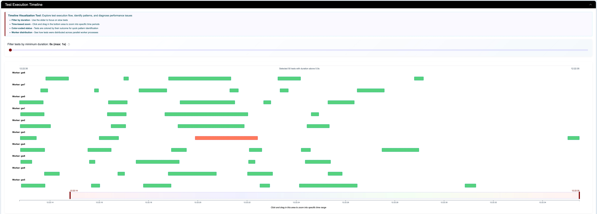
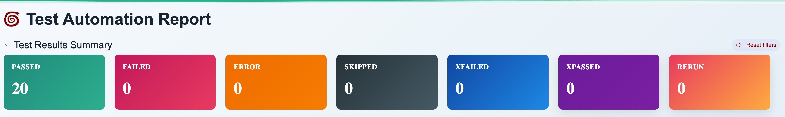
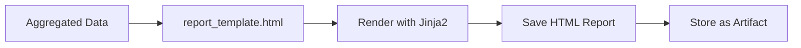
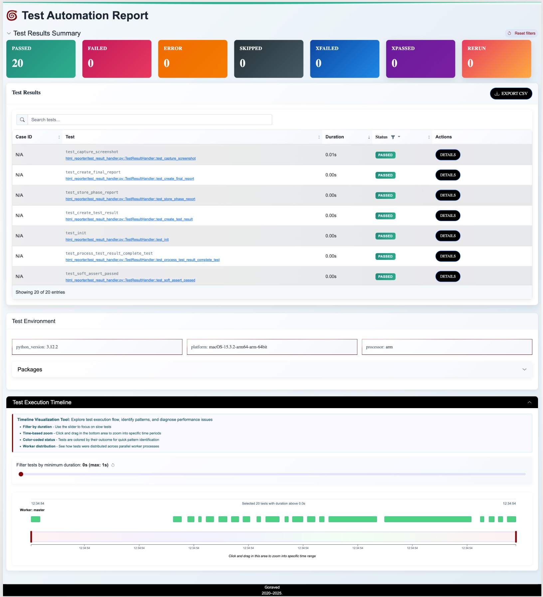
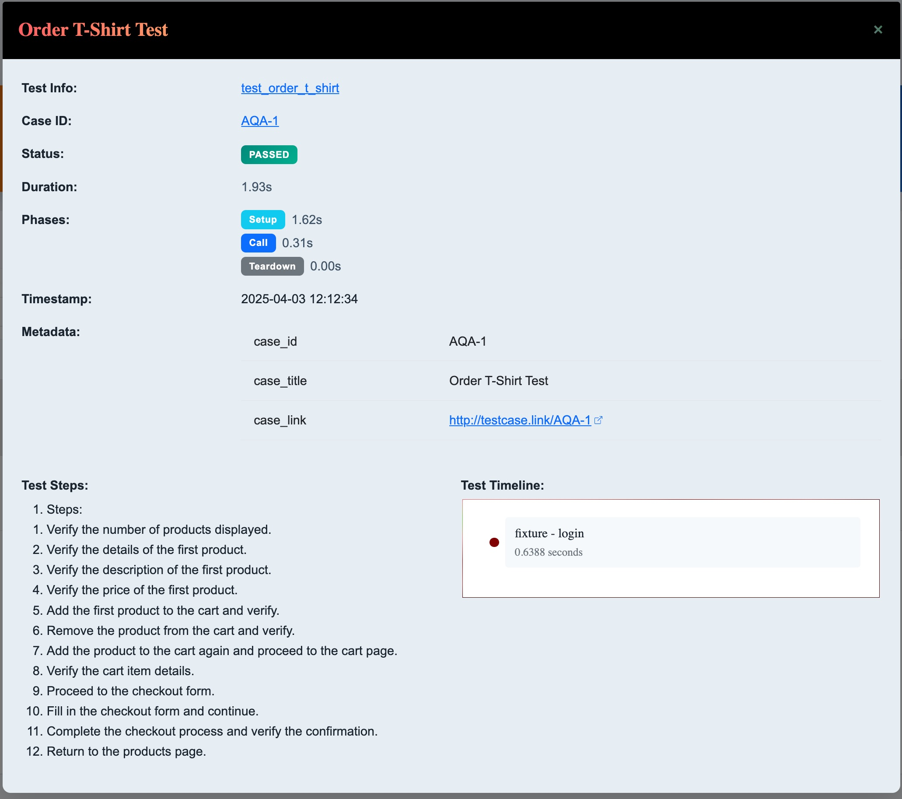
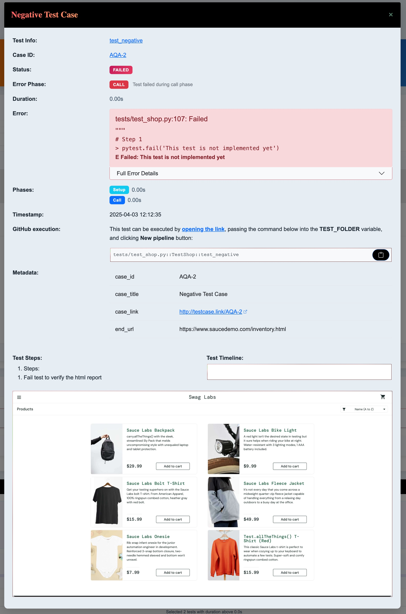
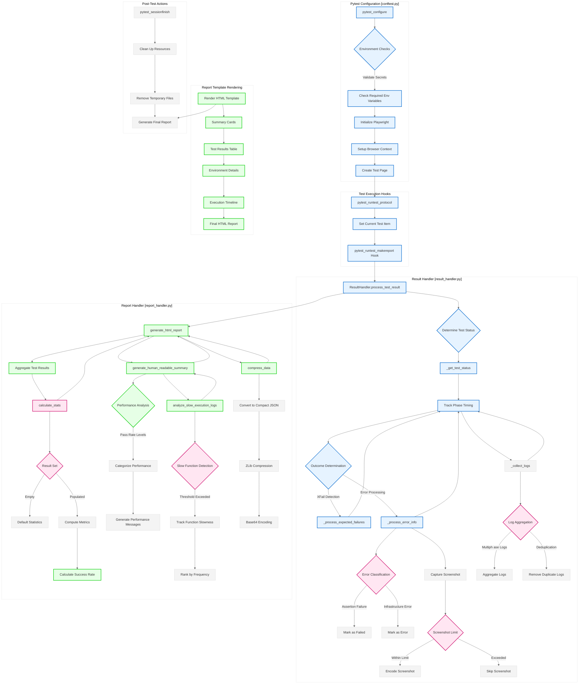

# HTML Test Report 📊

This custom HTML report is designed for automated reporting of test run results. It provides detailed information about
executed tests, execution environment, pass/fail statistics, and an interactive timeline with filtering capabilities.

## Main Features 🚀

- 📈 High-level statistics and colorful status cards for quick overview
- 📝 Detailed table with results for each test
    - 🎨 Color-coded test statuses (`passed`, `failed`, `skipped`, `xfailed`, `xpassed`, `error`)
    - ⏱ Execution duration measurement for each test
    - 🔗 Links to test cases in Jira/TestRail
    - 👉 Modal window with additional details when clicking on a test
- 🕓 Timeline visualization of test execution sequence
    - 🔍 Zoom and filter by specific time interval
    - ⚙️ Filter by minimum duration to find slow tests
- 💻 Information about execution environment (Python versions, libraries, plugins)
- 📥 Export of filtered results to CSV with localized headers
- 🪲 Section with error details and logs for quick debugging
- 📸 Automatic screenshot on test failure (for UI tests with Playwright)

## Why Our Report is Better Than Market Alternatives 🥇

- **Optimized Performance**
    - 🚀 Virtualized results table with "lazy" data loading — shows only visible rows
    - 📦 Data compression — reduces report size up to 10 times compared to competitors
    - 🖼️ On-demand loading of heavy screenshots — maintains fast report loading
    - 📊 Optimized timeline rendering with D3.js — fast visualization even with thousands of tests
    - 📱 Responsive design — convenient display on all devices

- **Improved UX/UI**
    - 🎨 Modern design with localization and modern styling
    - 🔍 Intelligent search across all table fields
    - 🏷️ Smart filtering by statuses
    - 📋 Detailed information in modal windows
    - 🌊 Status wave at the top of the page for quick perception of test state

- **Innovative Features**
    - ⏱️ Interactive timeline with zoom capability for execution time analysis
    - 📈 Analysis of slow tests and functions with optimization recommendations
    - 🔄 Soft assert support for full reporting of all issues in a test
    - 🔍 Recommendations for test reruns directly in GitLab
    - 🔧 No external dependencies — works offline and in secured environments

- **Technical Advantage**
    - 📦 Internet independence — all resources embedded in a single HTML file
    - 📏 Lightweight — even for large reports the final file size rarely exceeds 5-10 MB
    - ⚡ Fast loading time — opens in seconds thanks to optimizations
    - 🔒 Security — no external dependencies or network connections
    - 🛠️ Support for multi-process execution with pytest-xdist

## Functionality 🛠️

1. **Test Results Collection**
    - Using a custom `pytest_runtest_makereport` hook to collect data during test execution
    - The hook is called for each test phase (setup, call, teardown) and allows to get detailed information about the
      test (status, duration, metadata, logs)

   Example `pytest_runtest_makereport` hook implementation:
   ```python
   # conftest.py
   @pytest.hookimpl(tryfirst=True, hookwrapper=True)
   def pytest_runtest_makereport(item: "Item", call: CallInfo) -> None:
       """
       Create detailed test reports with rich metadata for all test phases.

       This hook captures test outcomes, screenshots, logs, and exception details for reporting
       during setup, call, and teardown phases. The implementation has been refactored to use
       the TestResultHandler class for improved maintainability.

       Args:
           item: The pytest test item being run
           call: Information about the test function call
       """
       # Import the handler here to avoid circular imports
       from html_reporter.result_handler import ResultHandler

       # Yield to allow pytest to generate the report first
       outcome = yield
       report = outcome.get_result()

       # Use the handler class to process the test result
       handler = ResultHandler(item.config)
       handler.process_test_result(item, call, report)
   ```

    - Results processing is delegated to a separate `ResultHandler` class for better separation of logic and code
      maintenance
    - `ResultHandler` is responsible for:
        - Initializing and saving test status data
        - Tracking timings for each phase (setup, call, teardown)
        - Processing different statuses and failure reasons
        - Collecting metadata (descriptions, markers, links)
        - Collecting logs and stdout/stderr
        - Collecting screenshots for UI tests
    - All collected data is stored in the `self.config._test_results` dictionary for further processing

   Data collection process diagram:

   ```mermaid
   graph LR
       A[Test Run] --> B[pytest_runtest_makereport]
       B --> C[ResultHandler.process_test_result]
       C --> D[Get/Create TestResult]
       C --> E[Track Phase Timing]
       C --> F[Store Phase Report] 
       C --> G{Is Test Complete?}
       G -->|Yes| H[Create Final Report]
       H --> I[Determine Outcome]
       H --> J[Process Soft Asserts]
       H --> K[Create TestResult Object]
       H --> L[Process Screenshots & Metadata]
       H --> M[Collect All Logs]
       H --> N[Save TestResult]
   ```
    - Support for collecting results from multiple workers when using `pytest-xdist` for parallel execution

2. **Soft Assert**
    - Implementation of Soft Assert mechanism to continue test execution even when an error occurs

   Example of using Soft Assert:
    ```python
    # test_example.py  
    def test_soft_asserts(self, soft_assert):
        with soft_assert:
            assert 1 == 2, "This assertion fails"
        with soft_assert:
            assert 2 == 2, "This assertion passes" 
    ```

    - Collection of all Soft Assert errors and displaying them in the report
    - Support for Soft Assert to mark the test as `failed` or `xfailed` when errors are present

3. **Time Tracking**
    - Measuring execution time for each test phase (setup, call, teardown)
    - Calculating the total test duration

   Visualization of test durations:

   

    - Displaying duration for each test in the results table
    - Ability to filter and search for slow tests

4. **Handling Various Pytest Statuses**
    - Support for all possible test statuses in Pytest (`passed`, `failed`, `skipped`, `xfailed`, `xpassed`, `error`)
    - Displaying status for each test in the results table with color coding

   Example of status color coding:

   

    - Ability to filter and search tests by status

5. **Collecting Additional Information**
    - Collecting test metadata (Test ID, description, markers)
    - Collecting logs, stdout/stderr for each test
    - Collecting information about execution environment (Python versions, libraries, plugins)
    - Collecting screenshots on UI test failures (using Playwright)

6. **HTML Report Generation**
    - Creating an HTML report based on collected data using a Jinja2 template
    - Displaying high-level statistics (total number of tests, passed/failed, run duration)
    - Detailed table with results for each test
    - Ability to interactively filter and sort data in the table
    - Timeline visualization of test execution sequence with zoom and filtering capabilities
    - Section with error details and logs for debugging

7. **Results Export**
    - Ability to export filtered results to a CSV file

   Example of exported CSV file:
    ```csv
    Test Scenario ID,Test Name,Autotest,Duration,Status,Business Process,Scenario Link
    "TEST-1100","Registration Form Check","test_registration_happy_path","5.25","PASSED","BP-100","https://..."
    "TEST-1101","Registration Error Check","test_registration_error","1.33","FAILED","BP-100","https://..."
    "TEST-1102","Application Save Check","test_save_application","3.78","SKIPPED","BP-101","https://..."  
    ```

    - Automatic addition of headers with localized column names

## Technical Optimizations and Their Benefits 🔧

1. **Virtualized Results Table**
    - Implementation of a "virtual" table that renders only visible rows, not the entire dataset
    - Support for "infinite scroll" to load data while scrolling
    - Using the "windowing" pattern to display only visible elements in the DOM
    - Provides lightning speed even with thousands of tests

2. **Data Compression and Optimization**
    - Using pako.js for test data compression
    - Converting to Base64 for safe embedding in HTML
    - On-the-fly data decompression when working with the report
    - Deferred loading of screenshots and heavy data

3. **Screenshot Optimization**
    - Storing screenshots in a separate memory object
    - Loading only when opening the details modal window
    - Removing duplicate screenshots for identical failures
    - Limiting screenshot size with automatic scaling

4. **Intelligent Timeline Processing**
    - Using D3.js for efficient timeline rendering
    - Implementing zoom with brushing technique
    - Worker-based separation for better parallel execution analysis
    - Dynamic loading of only the visible part of the timeline when zooming

5. **DOM and CSS Optimization**
    - Using efficient CSS selectors to improve performance
    - Reducing DOM elements through virtualization
    - Using CSS variables for fast style rebuilding
    - Using responsive design for correct display on different devices

## Data Collection, Preparation, Aggregation, and Calculation 📊

The test results processing can be divided into several main stages:

1. **Data Collection During Execution**
    - Raw data about each test is collected in the `pytest_runtest_makereport` hook
    - For each test, a `TestResult` object is created containing all information (status, duration, metadata, logs,
      screenshots)

   Data collection process diagram:

    ```mermaid
    graph LR
        A[Test Run] --> B[pytest_runtest_makereport]
        B --> C[Create TestResult]
        C --> D[Collect Metadata]
        C --> E[Measure Durations] 
        C --> F[Capture Logs]
        C --> G[Take Screenshot]
    ```

    - Additionally, information about the execution environment is collected
    - All collected data is stored in the `self.config._test_results` dictionary for further processing

2. **Processing and Aggregation After Test Completion**
    - After all tests are completed, the `pytest_sessionfinish` hook is triggered
    - In this hook, data from all workers is aggregated (if `pytest-xdist` was used)
    - Overall metrics and statistics are calculated (number of tests, passed/failed, run duration)
    - Data is grouped and structured for convenient display in the HTML report

   Aggregation process diagram:

    ```mermaid
    graph TD
        A[pytest_sessionfinish] --> B[Aggregate Results]
        B --> C[Collect from Workers]
        B --> D[Calculate Stats]
        D --> E[Total Tests] 
        D --> F[Passed/Failed]
        D --> G[Duration]
        D --> H[Pass Rate]
        B --> I[Group & Structure Data]
    ```

3. **Calculation of Additional Metrics**
    - Calculation of test pass percentage
    - Finding the fastest and slowest tests
    - Calculation of average, median, and 90th percentile of test durations
    - Analysis of tests that required reruns

4. **HTML Report Generation**
    - Based on collected and aggregated data, an HTML report is generated using the `report_template.html` template
    - Data is passed to the template using Jinja2 and rendered into a ready HTML file
    - The report is saved to the file system and can be saved as an artifact in the CI system

5. **Final Report Optimization**
    - Data compression to reduce file size
    - Embedding all resources (CSS, JS, fonts) for offline use
    - Implementation of virtualization for efficient work with large datasets
    - Deferred loading of heavy components for fast first render

Report generation process diagram:



As we can see, the report generation process is quite complex and includes various stages of collection, processing,
aggregation, and visualization of test results. Pytest hooks play a key role here, allowing convenient integration into
the test lifecycle and collecting all necessary information.

Thanks to the modular approach and splitting logic into separate classes/functions, the code looks clean and
maintainable. And the presence of a large number of unit tests helps ensure that everything works as expected and
protects against regressions during further changes.

## Code and Unit Tests 🧪

All logic for working with results is split into separate classes and functions in separate modules for better
maintenance:

- `conftest.py` - Main module with pytest hooks and plugins
- `report_handler.py` - Aggregation of results, statistics generation, HTML rendering
- `result_handler.py` - Classes for processing the result of each individual test
- `report_template.html` - Jinja2 template for HTML report

There is also a full set of unit tests in `test_report_handler.py` and `test_result_handler.py`, which check all edge
cases and cover the major part of functionality. A good structure of arrange-act-assert is maintained.

Example of a unit test for the `_generate_gitlab_link` method in the `TestResult` class:

```python
# test_result_handler.py
def test_generate_gitlab_link(self, mock_item):
    result = TestResult(mock_item, "passed", 0.5)

    expected_link = "https://gitlab.company.com/project/project_aqa/-/blob/main/tests/test_example.py#L42"
    assert result.gitlab_link == expected_link
```

## Screenshots 📸

For a better understanding of the functionality, here are a few screenshots of key parts of the report:

1. **General View** - statistics, filters, test table, timeline
   

2. **Test Details** - when clicking on a test in the table, a modal opens with full info about the test (step
   description, metadata, logs, screenshot)
   

3. **Failure Information** - details also include error traces, error messages, and links to launch a retry in GitLab
   

---

## Complete Process Diagram



©Goraved 2025